# Технический аудит: av.by

## 1. Название ресурса

AV.by — крупнейшая автомобильная площадка Беларуси: доска объявлений о продаже авто с пробегом и запчастей, журнал, каталог услуг и сервисы для автовладельцев (проверка по VIN, гараж, оценка стоимости, кредит и лизинг).

Адрес: https://av.by/

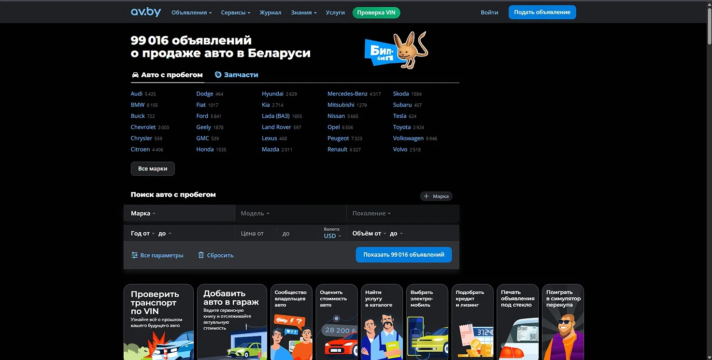

На главной странице расположены: шапка с меню (Объявления, Сервисы, Журнал, Знания, Услуги, кнопка «Проверка VIN»), счётчик объявлений (около 99 тысяч на момент проверки), вкладки «Авто с пробегом» и «Запчасти», список марок с количеством объявлений, форма поиска (марка, модель, поколение, год, цена, объём) и ряд промо-карточек сервисов. Ниже идут блоки «Интересное за сегодня», «Новые авто», «Свежие новости», «Компании и услуги» и «Автожурнал».

---

## 2. Анализ архитектуры и технологического стека

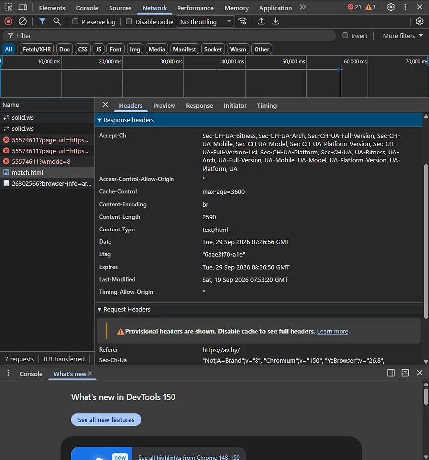

Веб-сервер: nginx.

Протокол: HTTP/2 (HTTP/3 не обнаружен).

Сжатие: Brotli (Content-Encoding: br).

Кэширование: Cache-Control: max-age=3600 (1 час), Expires выставлен на час позже Date, также присутствуют ETag и Last-Modified.

CORS: открыт (Access-Control-Allow-Origin: *), дополнительно указан Timing-Allow-Origin: *.

Client Hints: сервер запрашивает у браузера данные об устройстве через заголовок Accept-CH (Sec-CH-UA, Sec-CH-UA-Platform, Sec-CH-UA-Full-Version и др.).

Фронтенд: Next.js (SSR/SSG + гидрация React). Признаки:
- корневой контейнер div id="__next";
- скрипты из каталога /_next/static/chunks/pages/ (например, privacy-policy-*.js);
- служебные артефакты _app-*.js, _buildManifest.js, _ssgManifest.js, _middleware;
- на DOM-элементах присутствуют свойства __reactFiber$ и __reactProps$ — React привязан к серверной разметке (гидрация).

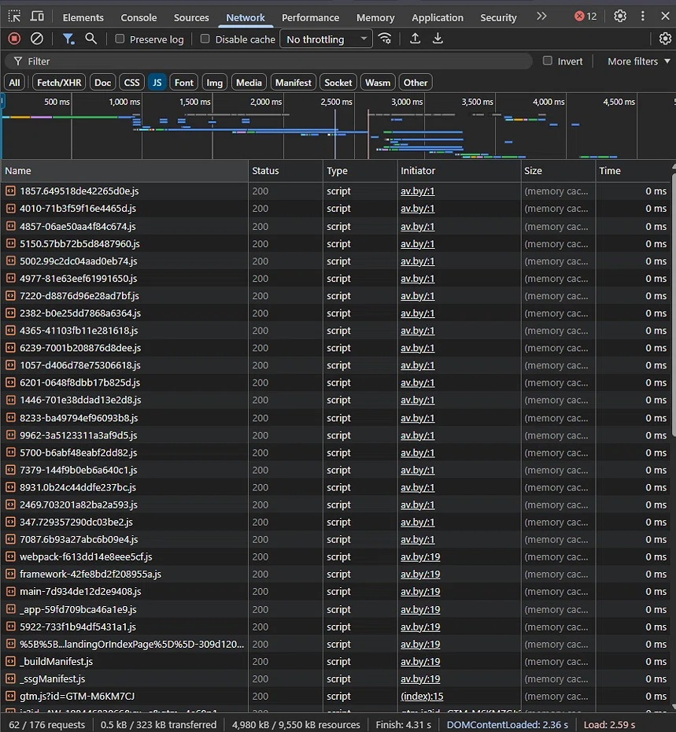

Сборщик: Webpack — об этом говорят файлы webpack-*.js, framework-*.js, main-*.js и хешированные имена чанков (например, 1857.649518de42265d0e.js). Фильтр JS показал 62 запроса из 176, чанки в основном отдаются из memory cache.

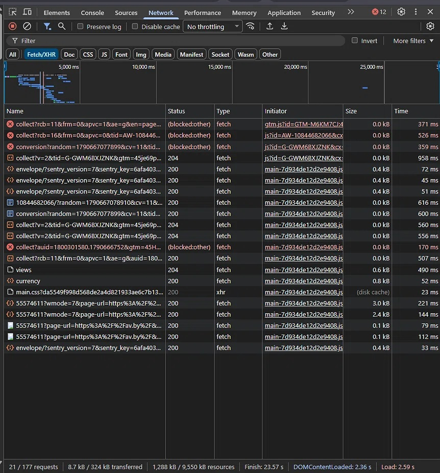

Fetch/XHR: приложение подгружает данные отдельными запросами (views, currency), стили main.css, а также отправляет события аналитики и ошибок (collect, envelope для Sentry, запросы Яндекс.Метрики). Часть запросов помечена как blocked:other — они заблокированы на стороне клиента (блокировщик рекламы).

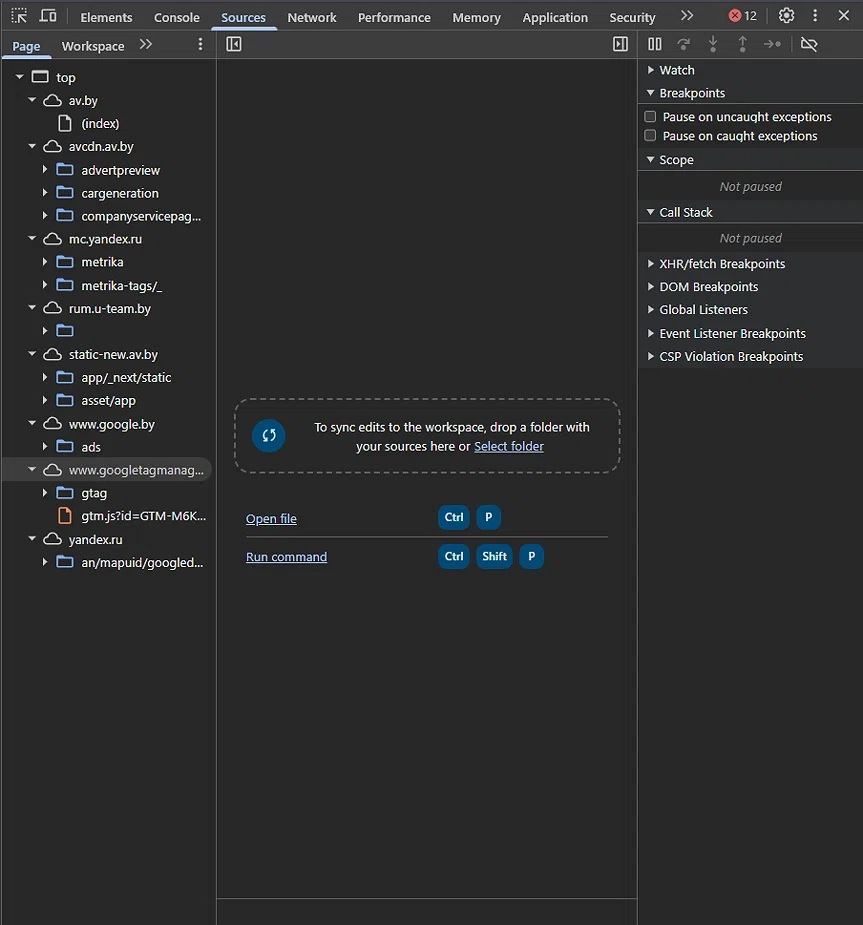

PWA-манифест: manifest.json содержит lang: ru, dir: ltr и иконки 192×192 и 512×512.

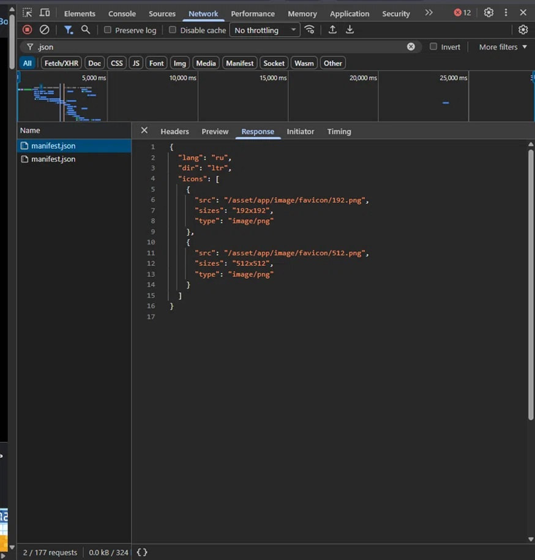

CDN: статика приложения и ассеты отдаются с static-new.av.by (app/_next/static, asset/app), изображения объявлений, поколений и компаний — с avcdn.av.by (advertpreview, cargeneration, companyservicephotomedium).

Сторонние домены (по вкладке Sources): mc.yandex.ru, yandex.ru, www.google.by, www.googletagmanager.com, rum.u-team.by.

Оптимизация загрузки: ключевые изображения подгружаются через link rel="preload" as="image", логотип — с fetchpriority="high".

---

## 3. Семантические элементы HTML5

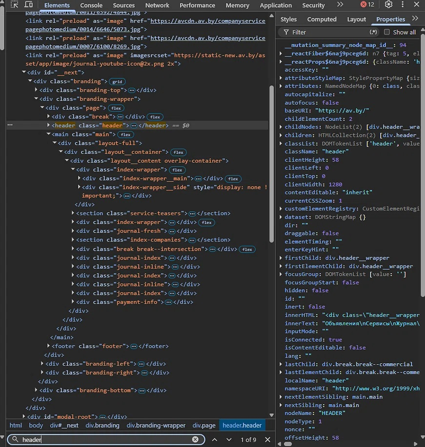

Вывод: семантика используется частично.

Проверка проводилась через консольный скрипт, который прошёлся по тегам: header, nav, main, section, article, aside, footer, figure, details, summary, time, mark, и вывел результат через console.table.

Результат:

| Тег | Количество |
|---|---|
| header | 1 |
| nav | 2 |
| main | 1 |
| section | 2 |
| article | 50 |
| footer | 1 |
| time | 41 |
| aside, figure, details, summary, mark | 0 |

Объявления оформлены тегами article (50 карточек), даты — тегами time (41), то есть контентная часть размечена корректно. Каркас страницы тоже содержит header, nav, main и footer. При этом aside, figure, details, summary и mark не используются: боковые блоки, подписи к изображениям и раскрывающиеся элементы оформлены обычными div.

---

## 4. Вёрстка div-ами и семантические классы

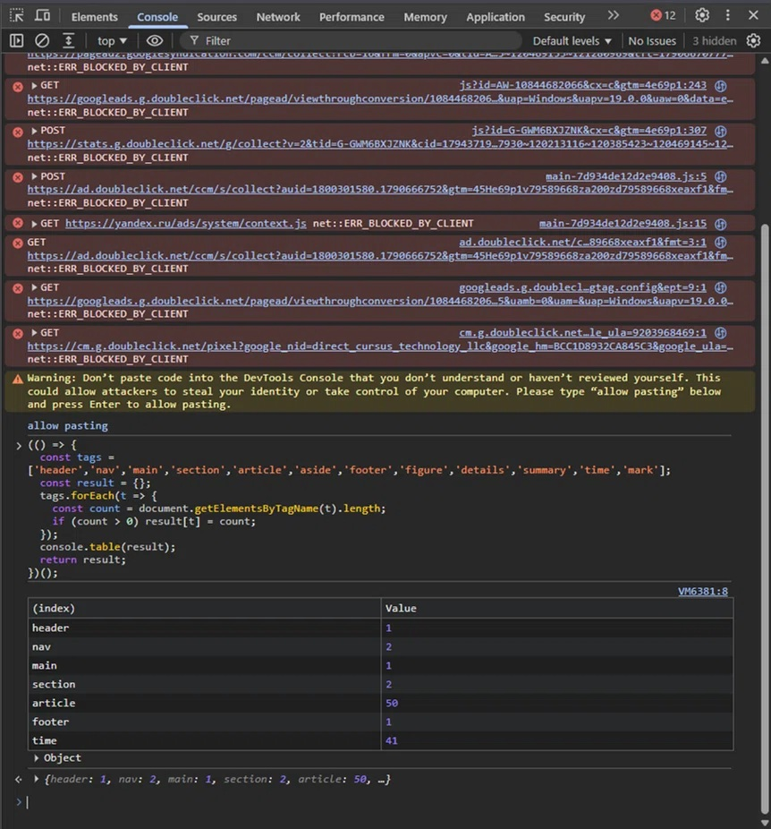

Корневой контейнер: div id="__next".

Структура верхнего уровня: div.branding → div.branding-wrapper → div.page → header.header → main.main → footer.footer. Рядом расположены branding-left, branding-right, branding-bottom (рекламные зоны по краям страницы) и div id="modal-root" для модальных окон.

Внутри main: layout-full → layout__container → layout__content overlay-container → index-wrapper (с элементами index-wrapper__main и index-wrapper__side) → блоки service-teasers, journal-fresh, index-companies, journal-index, journal-inline, payment-info.

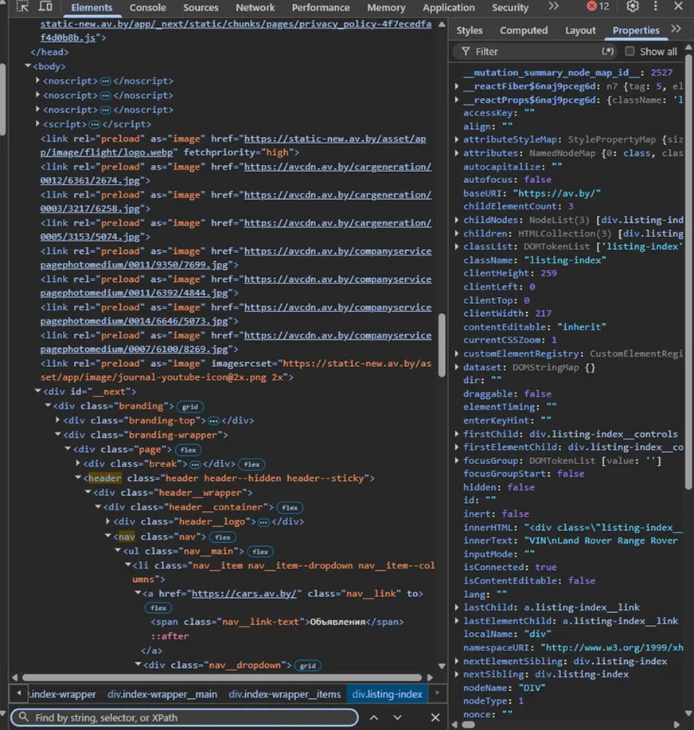

Классы БЭМ-подобные: блоки (header, nav, layout, index-wrapper, listing-index), элементы через «__» (header__wrapper, header__container, header__logo, nav__main, nav__item, nav__link, nav__link-text, nav__dropdown, listing-index__controls, listing-index__link) и модификаторы через «--» (header--hidden, header--sticky, nav__item--dropdown). Названия читаемые и отражают назначение блока — в отличие от drom.ru, где классы генерируются CSS-in-JS.

Для раскладки активно используются grid и flex (в панели Elements помечены бейджами у branding, page, main, index-wrapper).

Боковой блок index-wrapper__side скрыт инлайновым стилем display: none !important.

Атрибуты data-*: у проверенных элементов (header, listing-index) объект dataset пуст, то есть data-атрибуты в этих блоках не используются.

---

## 5. Адаптивность и media-запросы

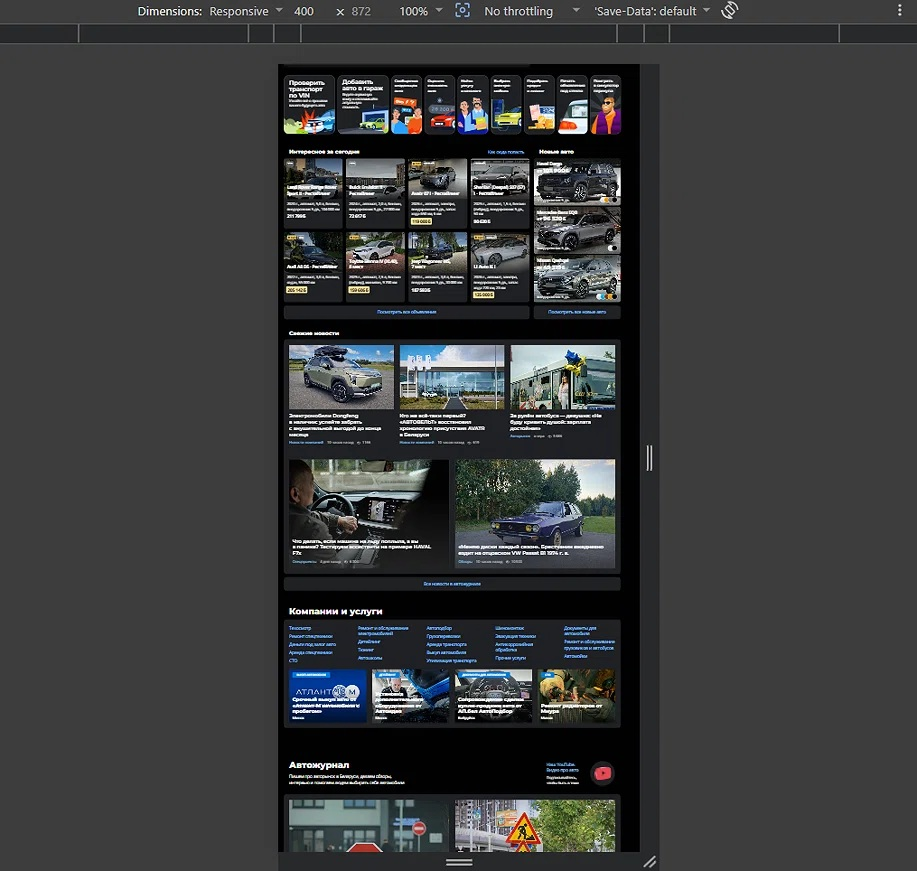

Проверка проводилась в Device Toolbar: режим Responsive, размер 400×872, масштаб 100%, без троттлинга.

Наблюдения:
- страница помещается по ширине без горизонтальной прокрутки;
- промо-карточки и блоки «Интересное за сегодня», «Новые авто», «Свежие новости», «Компании и услуги», «Автожурнал» выстраиваются друг под другом;
- внутри блоков сохраняется сетка карточек — отображается сжатая версия страницы;
- сайт определяет устройство на стороне сервера: в cookies есть DETECTED_DEVICE (значение desktop).

Десктопная версия (скриншот из раздела 1): горизонтальное меню, кнопки «Войти» и «Подать объявление», список марок в пять колонок, форма поиска с выпадающими фильтрами, ряд из восьми промо-карточек сервисов.

Тема оформления хранится в Session Storage (ключ pageThemeInfo), интерфейс отображается в тёмном оформлении.

Точное количество media-запросов не определялось — требуется дополнительная проверка через панель «Показать медиа-запросы».

---

## 6. Lighthouse

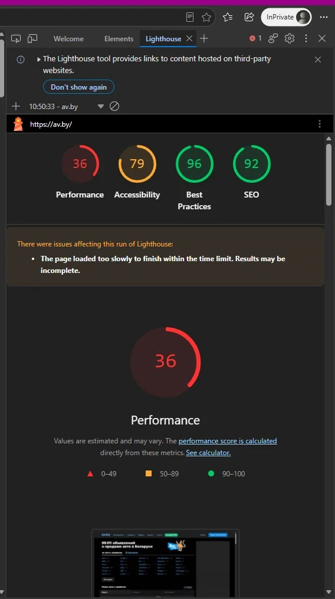

Условия проверки: ноутбук, домашний Wi-Fi, браузер на базе Chromium 150 в приватном режиме (InPrivate), режим mobile, дата — 29.09.2026, 10:50:33.

Оценки:
- Performance (Производительность): 36
- Accessibility (Доступность): 79
- Best Practices (Лучшие практики): 96
- SEO: 92

Комментарий: Performance находится в красной зоне (0–49). Причина — большое количество сторонних скриптов (аналитика, реклама, пиксели) и объём ресурсов: около 220 запросов и около 12 МБ. Lighthouse также предупредил, что страница загружалась слишком долго и результаты могут быть неполными. Доступность (79) — в жёлтой зоне, Best Practices (96) и SEO (92) — в зелёной.

---

## 7. Локальное хранилище и cookies

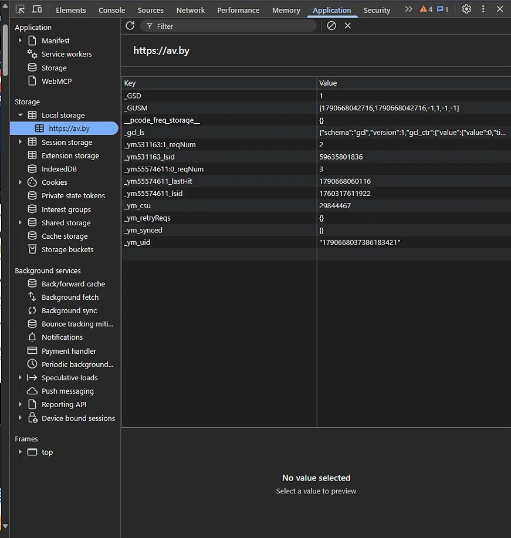

Local Storage (https://av.by):
- _GSD — служебный флаг (значение 1)
- _GUSM — служебный массив меток времени
- __pcode_freq_storage__ — счётчик частоты показов (значение {})
- _gcl_ls — данные Google Ads (gcl)
- _ym531163:1_reqNum, _ym531163_lsid — данные счётчика Яндекс.Метрики 531163
- _ym55574611:0_reqNum, _ym55574611_lastHit, _ym55574611_lsid — данные счётчика Яндекс.Метрики 55574611
- _ym_csu, _ym_retryReqs, _ym_synced, _ym_uid — служебные ключи Метрики

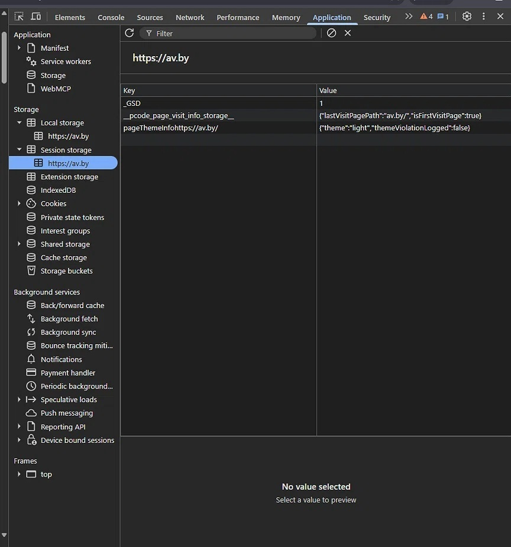

Session Storage:
- _GSD — служебный флаг (значение 1)
- __pcode_page_visit_info_storage__ — информация о визите ({"lastVisitPagePath":"av.by/","isFirstVisitPage":true})
- pageThemeInfohttps://av.by/ — настройки темы ({"theme":"light","themeViolationLogged":false})

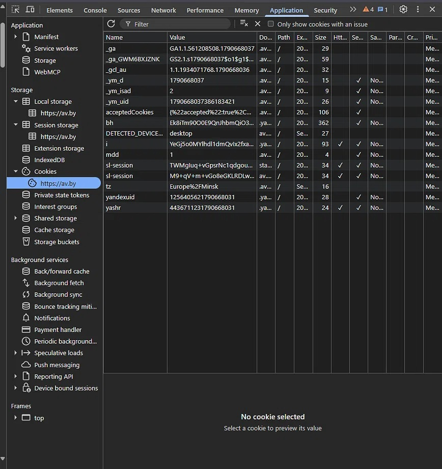

Cookies:
- _ga — идентификатор клиента Google Analytics
- _ga_GWM6BXJZNK — состояние сессии GA4
- _gcl_au — конверсии Google Ads
- _ym_d, _ym_isad, _ym_uid — данные Яндекс.Метрики (дата первого визита, проверка блокировщика рекламы, ID пользователя)
- acceptedCookies — согласие на использование cookies
- bh, i, yandexuid, yashr — cookies Яндекса; i и yashr имеют флаг HttpOnly
- DETECTED_DEVICE — определённый тип устройства (desktop)
- mdd — служебный флаг (значение 1)
- sl-session — сессионный токен (два экземпляра: для av.by и для соседнего домена), HttpOnly и Secure
- tz — часовой пояс (Europe/Minsk)

Вывод: Local Storage занят в основном данными аналитики (Метрика, Google Ads) и служебными счётчиками показов, Session Storage — темой и информацией о визите, cookies — сессией, определением устройства, часовым поясом, согласием и идентификаторами сторонних сервисов.

---

## 8. Маркетинговые инструменты и аналитика

Метод проверки: вкладка «Сеть» → фильтры по ключевым словам analytics, metrika, pixel, tagmanager, gtag, vk, googletagmanager.

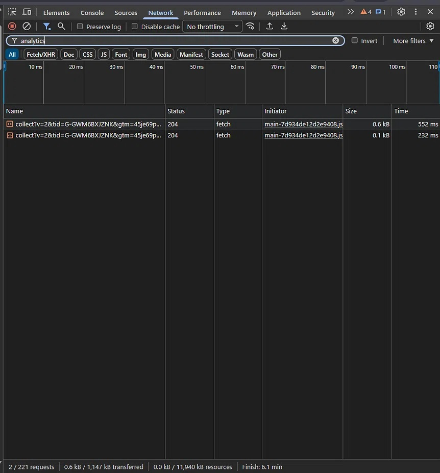

Google Analytics 4 (G-GWM6BXJZNK): по фильтру analytics зафиксированы 2 запроса collect?v=2&tid=G-GWM6BXJZNK (статус 204, инициатор main-*.js).

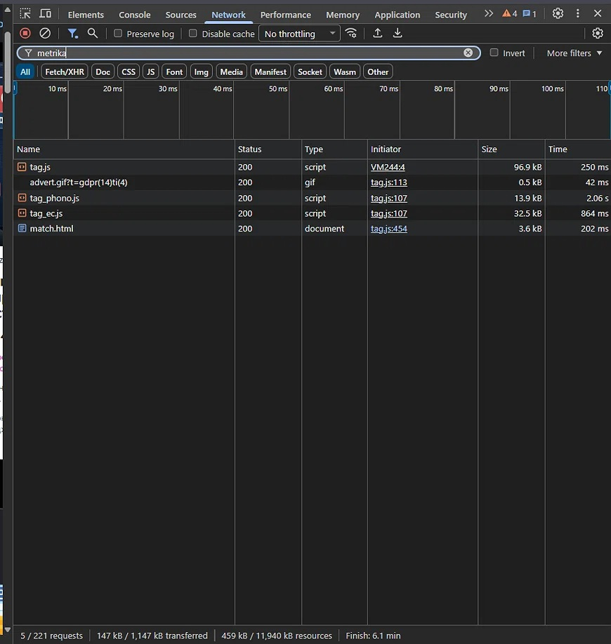

Яндекс.Метрика: по фильтру metrika загружаются tag.js (около 97 кБ), tag_phono.js, tag_ec.js, match.html и пиксель advert.gif. Счётчики: 55574611 и 531163 (по данным Local Storage).

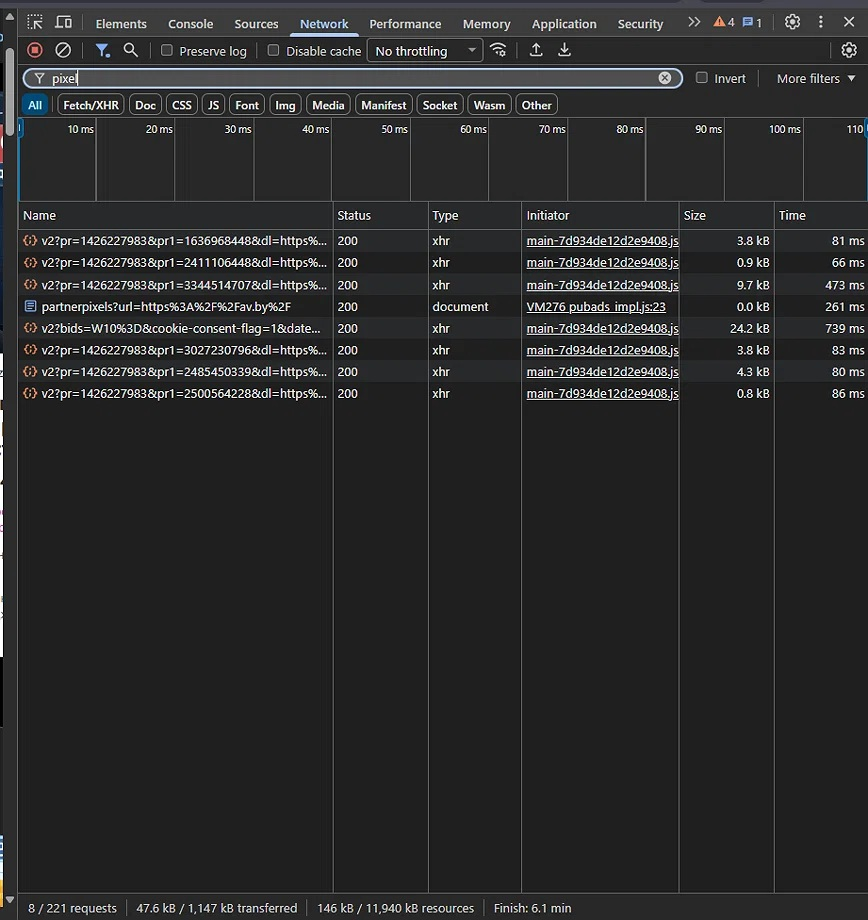

Пиксели: по фильтру pixel — запросы v2?pr=1426227983&pr1=… (xhr, инициатор main-*.js), partnerpixels?url=https://av.by/ (инициатор pubads_impl.js, Google Ad Manager) и запрос v2?bids=… (около 24 кБ), похожий на механизм рекламных ставок.

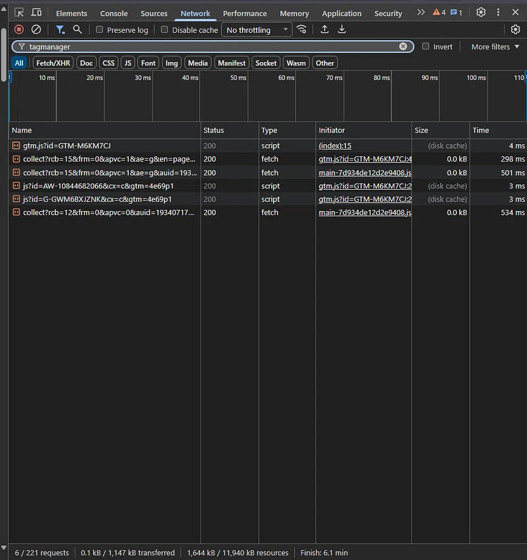

Google Tag Manager (GTM-M6KM7CJ): gtm.js подключается из (index) и загружает скрипты Google Ads (AW-10844682066) и GA4 (G-GWM6BXJZNK).

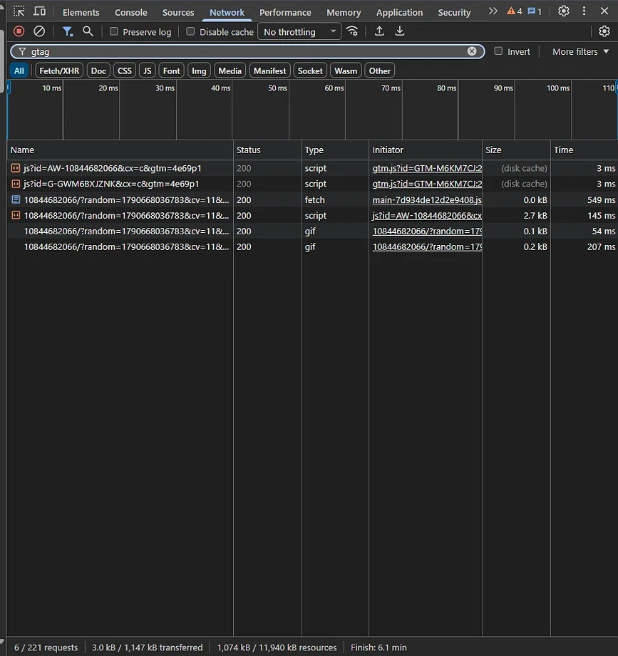

Google Ads (AW-10844682066): по фильтру gtag найдены js?id=AW-10844682066, js?id=G-GWM6BXJZNK и конверсионные запросы 10844682066/?random=… (script, fetch, gif).

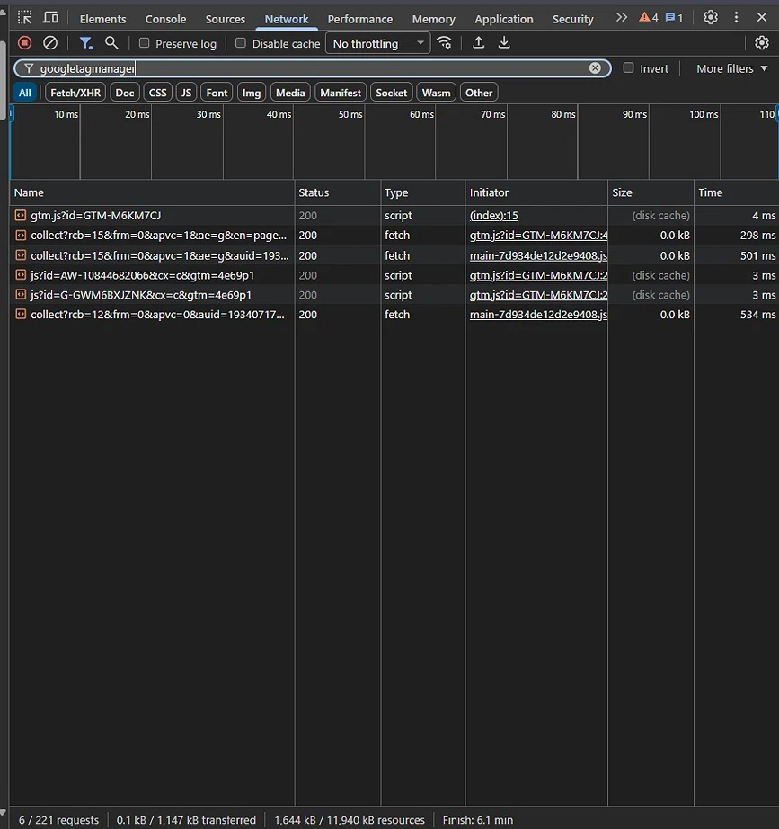

VK Pixel (ID 1426227983): 10 запросов по фильтру vk — v2?pr=1426227983 (xhr из main-*.js), пинги и event?ad-session-id=… из context.js (рекламный скрипт Яндекса).

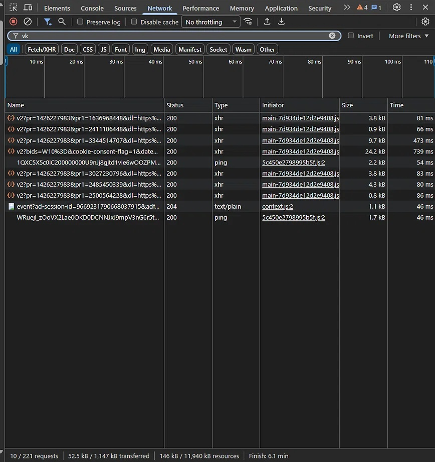

Итог по googletagmanager: 6 запросов — gtm.js, collect и загрузка скриптов AW-… и G-…, часть из которых берётся из disk cache.

Также обнаружены:
- Яндекс.Директ / рекламные скрипты Яндекса (context.js);
- Google Ad Manager (pubads_impl.js);
- Sentry (запросы envelope?sentry_version=7&sentry_key=6afa403…) — мониторинг ошибок;
- rum.u-team.by — домен мониторинга производительности.

Часть запросов помечена как ERR_BLOCKED_BY_CLIENT — их блокирует браузерный блокировщик, поэтому реальный набор трекеров без блокировщика может быть шире.

Вывод: на сайте подключён широкий стек аналитики и рекламы (Google, Яндекс, VK, Sentry). Это основная причина низкой оценки Performance (36).

---

## 9. Итоговые выводы

Сильные стороны:
- современный стек: Next.js (SSR/SSG + гидрация), Webpack, разбиение на чанки;
- CDN для статики и изображений (static-new.av.by, avcdn.av.by);
- сжатие Brotli, HTTP/2, кэширование ресурсов;
- высокие оценки Best Practices (96) и SEO (92);
- читаемая БЭМ-подобная вёрстка;
- корректная разметка карточек (article) и дат (time);
- есть PWA-манифест и приоритизация ключевых изображений (preload, fetchpriority).

Зоны роста:
- Performance 36 — сократить и отложить загрузку сторонних скриптов, уменьшить объём ресурсов (около 12 МБ);
- Accessibility 79 — улучшить доступность (метки, контраст, структура);
- не используются aside, figure, details, summary — боковые блоки и подписи стоит размечать семантически;
- открытый CORS (Access-Control-Allow-Origin: *) — проверить необходимость;
- мобильная версия определяется по User-Agent на сервере, её нужно проверять отдельно от режима Responsive.
