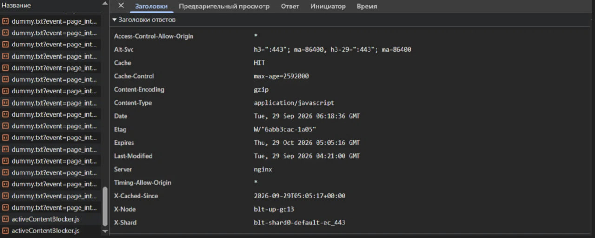
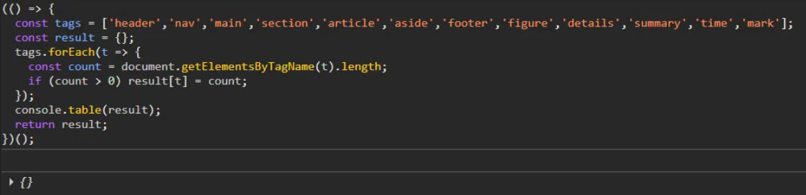
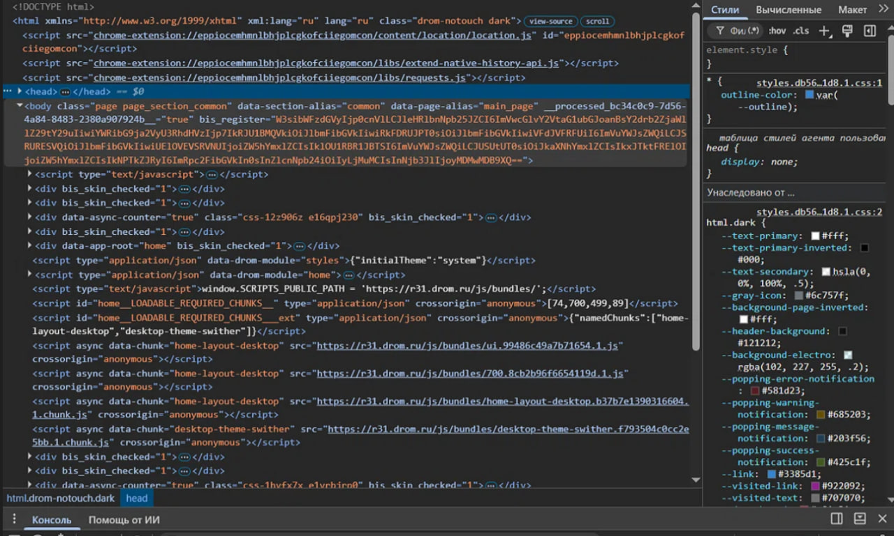
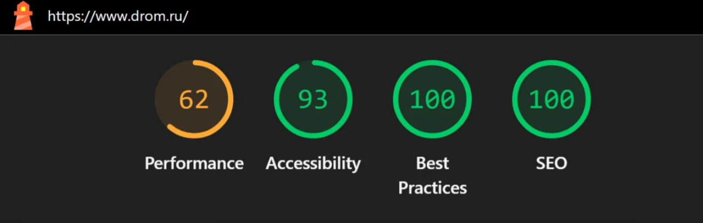
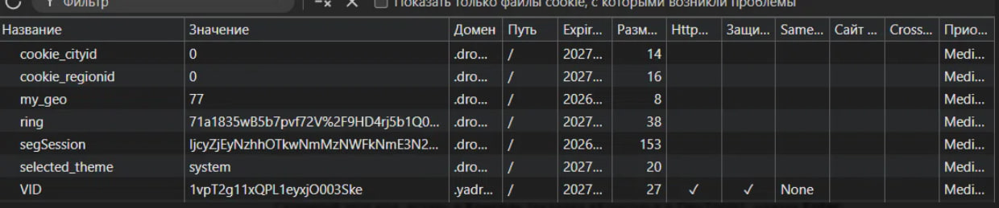
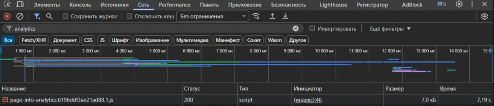
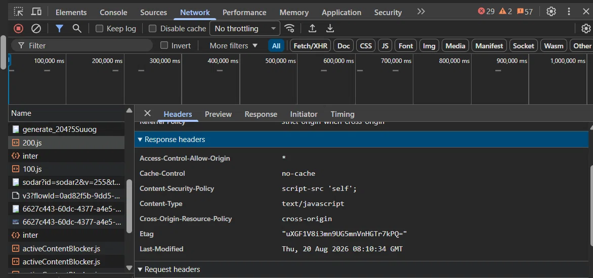

# Технический аудит: drom.ru

## 1. Название ресурса

Drom.ru — крупнейшая автомобильная площадка России с форумом и доской объявлений.

Адрес: https://www.drom.ru/

---

## 2. Анализ архитектуры и технологического стека

Веб-сервер: nginx.

Протокол: HTTP/3 (заголовок Alt-Svc: h3=":443"), также поддерживается HTTP/2.

Сжатие: gzip (Content-Encoding: gzip).

Кэширование: Cache-Control: max-age=2592000 (30 дней).

Балансировка нагрузки: через шарды (заголовки X-Node: blt-up-gc13, X-Shard: blt-shard0-default-ec_443).

CORS: открыт (Access-Control-Allow-Origin: *), что позволяет делать API-запросы с других доменов.

Фронтенд: SPA-архитектура. Исходный HTML почти пустой — в head содержатся только скрипты и JSON-данные, вся разметка рендерится JavaScript'ом.

Сборщик: Webpack — об этом говорят хешированные имена файлов (home.d80fb897069754cc.1.js, 700.8cb2b96f6654119d.1.js).

CDN для JS: статика и скрипты отдаются с отдельного домена r31.drom.ru.

Передача данных: используется тег script type="application/json" data-drom-module="..." для встраивания начальных данных в HTML (гибридный подход SSR + CSR).

Аналитика: собственный скрипт page-info-analytics.js, события отправляются через dummy.txt?event=...

---

## 3. Семантические элементы HTML5

Вывод: на главной странице семантические теги HTML5 отсутствуют.

Проверка проводилась через консольный скрипт, который прошёлся по тегам: header, nav, main, section, article, aside, footer, figure, details, summary, time, mark.

Результат: ни один из тегов не найден (пустой объект).

Причина: SPA-архитектура — вся разметка генерируется JavaScript'ом, поэтому в исходном HTML семантических тегов нет. Контент вставляется в div id="app-root" через виртуальный DOM.

---

## 4. Вёрстка div-ами и семантические классы

Корневой контейнер: div id="app-root".

Классы преимущественно служебные: drom-notouch, bis_skin_checked, css-12z906z e16qpj230.

Семантических классов (по БЭМ или логичным именам) на главной не обнаружено — классы генерируются автоматически (CSS-in-JS: css-12z906z e16qpj230).

Атрибуты data-* используются активно: data-page-section="common", data-page-alias="main_page", data-chunk="home-layout-desktop", data-drom-module="home". Это говорит о компонентном подходе.

---

## 5. Адаптивность и media-запросы

На теге html установлен класс drom-notouch dark — сайт определяет тач-устройства и тему пользователя.

Класс dark указывает на поддержку тёмной темы (переключается автоматически через selected_theme в cookies).

Мобильная версия присутствует (проверяется через режим эмуляции устройства в DevTools).

Точное количество media-запросов не указано — требуется дополнительная проверка через панель "Показать медиа-запросы".

---

## 6. Lighthouse

Условия проверки: ноутбук, домашний Wi-Fi, браузер Chrome, desktop-режим, дата — 29.09.2026.

Оценки:
- Performance (Производительность): 62
- Accessibility (Доступность): 93
- Best Practices (Лучшие практики): 100
- SEO: 100

Комментарий: производительность средняя (62) — вероятно, из-за большого объёма JavaScript и SPA-рендеринга. Остальные метрики высокие: SEO и Best Practices — идеальные (100), доступность — 93.

---

## 7. Локальное хранилище и cookies

Cookies:
- cookie_cityid — ID выбранного города
- cookie_regionid — ID региона
- my_geo — геолокация пользователя
- ring — служебный (балансировка/маршрутизация)
- segSession — токен сессии (153 символа)
- selected_theme — выбранная тема (значение: system)
- VID — Visitor ID (домен .yadro..., аналитика)

Local Storage:
- dante_cookie_showsByDay — счётчик показов за день
- dante_cookie_showsByHour — счётчик показов за час
- dante_cookie_showsByMonth — счётчик показов за месяц
- dante_cookie_showsByThreeDays — счётчик показов за 3 дня
- dante_cookie_showsByWeek — счётчик показов за неделю
- dante_cookie_uid — ID пользователя

Вывод: активно используется Local Storage для внутренней системы показа (dante_*) и cookies для сессии, геолокации и темы.

---

## 8. Маркетинговые инструменты и аналитика

Метод проверки: вкладка "Сеть" → фильтр по ключевым словам analytics, metrika, facebook, pixel, tagmanager, hotjar.

Результаты:
- Собственная аналитика: page-info-analytics.6196ddf3ae21ad88.1.js — внутренний скрипт Drom.
- События отправляются через dummy.txt?event=... (page_interaction_start, view&who=widgetPremium, autostory-widget и другие).
- Внешние счётчики (Google Analytics, Yandex.Metrika, Facebook Pixel, Hotjar, GTM) не обнаружены на главной странице.
- Также зафиксированы fallback-запросы fm.txt?failedAssetLoad=... — обработка ошибок загрузки ресурсов.

Вывод: drom.ru использует собственную систему аналитики и не подключает сторонние счётчики (по крайней мере, на главной странице).

# Технический аудит Kufar.by

## 1. Название ресурса / компании

Kufar.by — крупнейшая онлайн-площадка объявлений в Беларуси. Юридическое лицо — ООО «Куфар Тех». Категории: авто, недвижимость, электроника, товары, услуги, работа.

## 2. Адрес ресурса в сети
Основной домен: https://www.kufar.by
Поддомены: auto.kufar.by (авто), content.kufar.by (CDN), securepubads.g.doubleclick.net (реклама Google), cm.g.doubleclick.net (пиксели Google), www.google.com (reCAPTCHA, аналитика).

## 3. Архитектура и технологический стек
Серверная часть: Content-Type text/javascript и text/html, Cache-Control no-cache для JS, CSP script-src 'self', Cross-Origin-Resource-Policy cross-origin, Access-Control-Allow-Origin *, ETag присутствует, Last-Modified Thu, 20 Aug 2026 08:10:34 GMT. Статика отдаётся через CDN content.kufar.by с открытой CORS-политикой.

Клиентская часть: Turbopack (globalThis.TURBOPACK.push) — сборщик от Vercel для Next.js 13+. Sentry (_sentryModuleMetadata, sentry-application-key) — мониторинг ошибок. Хешированные чанки вида 24sqkk5g5cqop.js, 3inot-nff0kop.js, 01rnd8cwcq0sp.css — паттерн Next.js + Turbopack. CSS Modules на SCSS (классы styles-module-scss-module__I-Vmyq__content).
.webp)

Разметка: корневой div id="__next" подтверждает Next.js. Внутри div id="application", div id="content", div id="main-content", div id="bottom-bar". Link rel="preload" для SVG-иконок (оптимизация LCP). Noscript дважды. Script от Google Publisher Tags (pubads_impl.js) — Google Ad Manager.
.webp)
Итоговый стек: Next.js (React) + SCSS Modules + Turbopack, CDN content.kufar.by, Sentry, Google Ad Manager, веб-сервер OpenResty/Nginx (косвенно).

## 4. Семантические элементы HTML5
Проверка через консоль: header=0, nav=0, main=0, article=0, aside=0, figure=0, time=0, section=47, footer=1. Итог: {section: 47, footer: 1}.

Присутствуют только section (47) и footer (1). Отсутствуют header, nav, main, article, aside. Вместо main используется div id="main-content", вместо nav — div bottom-bar, верхняя панель — div id="application", карточки — section вместо article.

Семантические классы (замена тегам): styles-module-scss-module__I-Vmyq__content (контейнер контента), styles-module-scss-module__I-Vmyq__content_main (основной контент), styles-module-scss-module__1y4UWm__bottom_bar (нижняя панель), snackBar-container-bottom (уведомления), Popups-styles-module__pP8E7G__overlay (оверлей попапа), Popups-styles-module__pP8E7G__container (контейнер попапа).
.webp)

Вывод: семантика частичная, что снижает Accessibility до 68/100.

## 5. Адаптивность
Mobile 375×667: одноколоночная вёрстка, кнопки «По новизне» и «Фильтры» на всю ширину, фиксированная нижняя навигация (Главная, Избранное, Объявления, Сообщения, Профиль), кнопка «Позвонить» крупная на всю ширину карточки.
.webp)

Desktop 1568: многоколоночный список объявлений (фото + описание + метаданные), верхняя панель с логотипом, поиском, «Подать объявление», «Войти», правый блок избранного.
.webp)

Media-запросы: обнаружен breakpoint @media only screen and (max-width: 560px). Используются SCSS-модули с вложенными media-запросами.
.webp)  

Meta viewport: meta name="viewport" content="width=device-width, initial-scale=1" присутствует на auto.kufar.by и content.kufar.by.
.webp)

Вывод: ресурс адаптивен.

## 6. Lighthouse
Условия: университет, Гродно, Wi-Fi, MTS, Download 24.96 Мбит/с, Upload 5.63 Мбит/с, Ping 30 ms, Desktop, Chrome DevTools, https://www.kufar.by/l.
.webp)

Результаты: Performance 20/100, Accessibility 68/100, Best Practices 96/100, SEO 85/100.
.webp)

Причины: Performance низкий из-за тяжёлых JS-бандлов Turbopack, рекламы через securepubads.g.doubleclick.net, множества preload-ресурсов, Cache-Control no-cache для JS. Accessibility средний из-за отсутствия семантических тегов и, вероятно, проблем с alt и контрастом. Best Practices высокий благодаря HTTPS, CSP, HSTS. SEO в порядке.

## 7. Локальное хранилище и cookies
Cookies auto.kufar.by: _ga, _ga_D1TYH5F4Z4, _ga_ESH3WRCK3J, _ga_QITFZM0D0BE, _ga_WLP2F7MG5H (GA4, 5 потоков), _gcl_au (Google Ads), _tt_enable_cookie, _ttp (2 шт.) (TikTok Pixel).
.webp)

Cookies www.google.com (third-party): __Secure-1PAPISID, __Secure-1PSID, __Secure-1PSIDCC, __Secure-1PSIDTS, __Secure-3PAPISID, __Secure-3PSID, __Secure-3PSIDCC, __Secure-3PSIDTS, __Secure-BUCKET — Google-аутентификация и реклама.
.webp)

Local Storage auto.kufar.by: _GSD=1, _GUSM=[1790663364124, 1790663419691, 56, 2, 1, 56], _gcl_ls (Google Click ID), kufar-last-search (последний поисковый запрос), ma_cid=178308046334049889.
.webp)

Local Storage www.google.com: rc::h=1790663424327, rc::e=1 (reCAPTCHA).
.webp)

Session Storage auto.kufar.by: _GSD=1, tt_appInfo={"platform":"pc"}, tt_pixel_session_index={"index":1,"main":0}, tt_sessionId (TikTok-сессия).
.webp)

IndexedDB и Service Workers присутствуют, содержимое не раскрыто.

## 8. Маркетинговые инструменты и аналитика
Google Analytics 4 (5 потоков _ga*), Google Ads (_gcl_au, _gcl_ls), TikTok Pixel (_ttp, _tt_enable_cookie, tt_appInfo, tt_pixel_session_index, tt_sessionId), Google reCAPTCHA (rc::h, rc::e), Google Ad Manager (pubads_impl.js), DoubleClick (cm.g.doubleclick.net), Sentry (мониторинг ошибок), внутренний трекер inter (ping-запросы, статус 200, размер 0.0 kB, инициатор main.MWU2MzlzODM0OQ.js, время 150–552 ms).

Вывод: 
Kufar.by использует комбинированную систему аналитики: сторонние счётчики (Google Analytics 4 в пяти потоках, TikTok Pixel, Google Ads, DoubleClick, Google Ad Manager) и собственную внутреннюю систему трекинга — эндпоинт inter, работающий через ping-запросы. Собственный трекер фиксирует поведенческие события на странице (просмотры, клики, время взаимодействия) и работает параллельно со сторонними пикселями.
